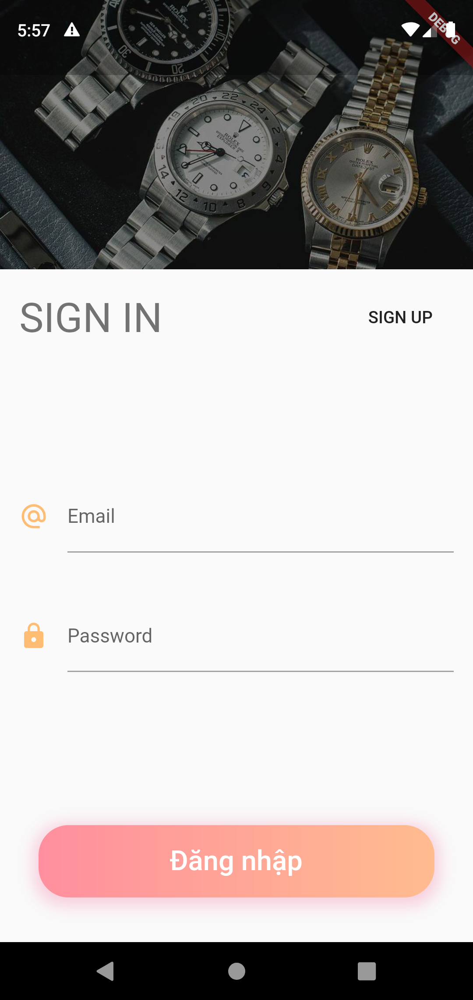
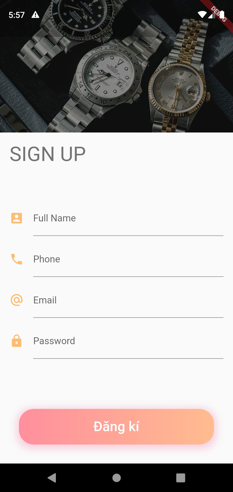
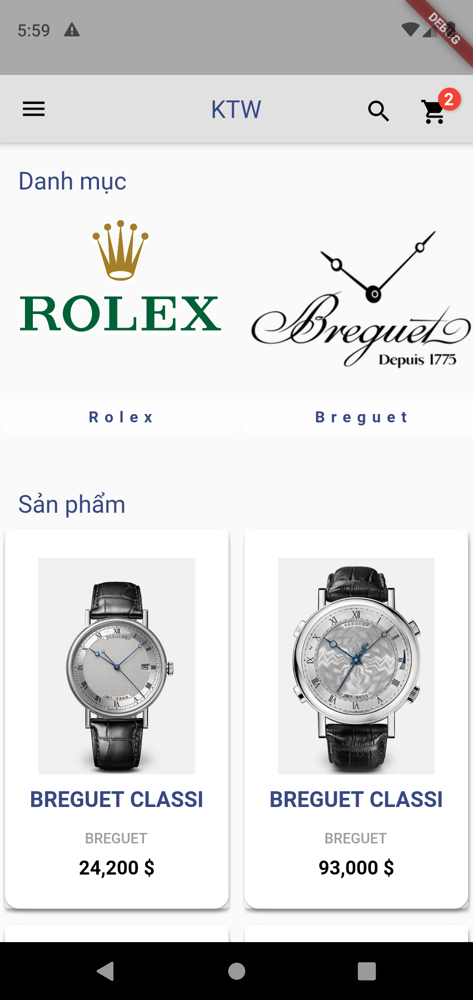
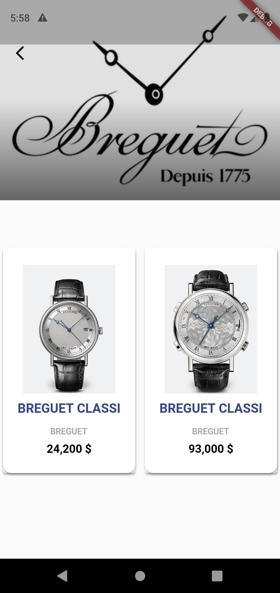
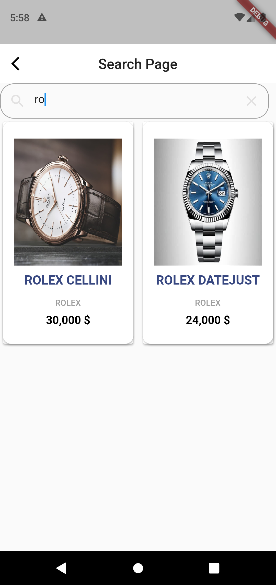
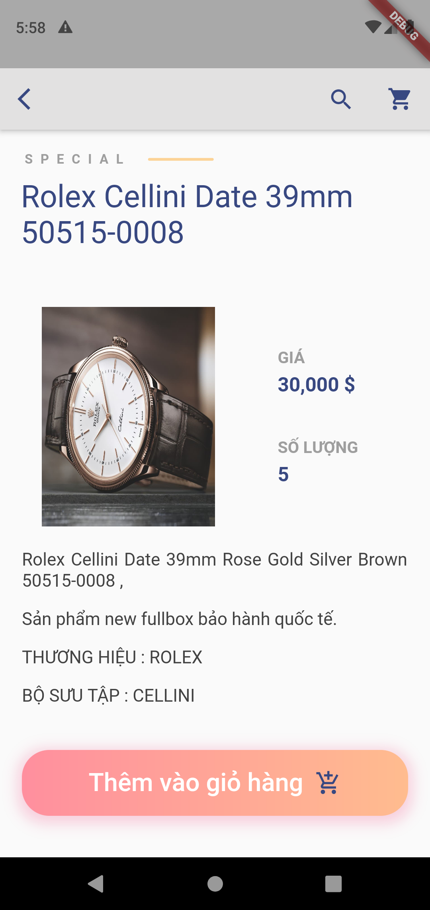
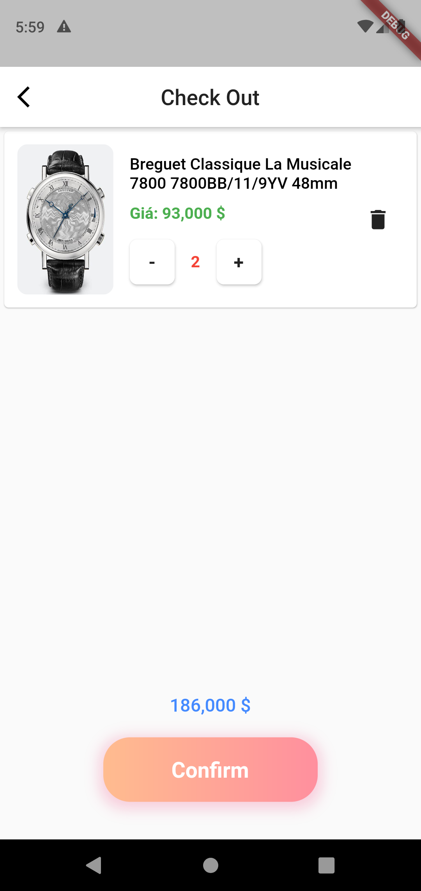
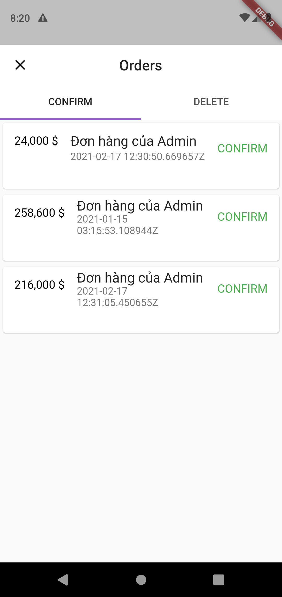

# flutter_watch_shop_app

 Flutter app using bloc + provider architecture

# Screenshot

  

    
   

   

     
     

   

     
     

   

       
       

   

      
      

   

       
       

   

       
       

